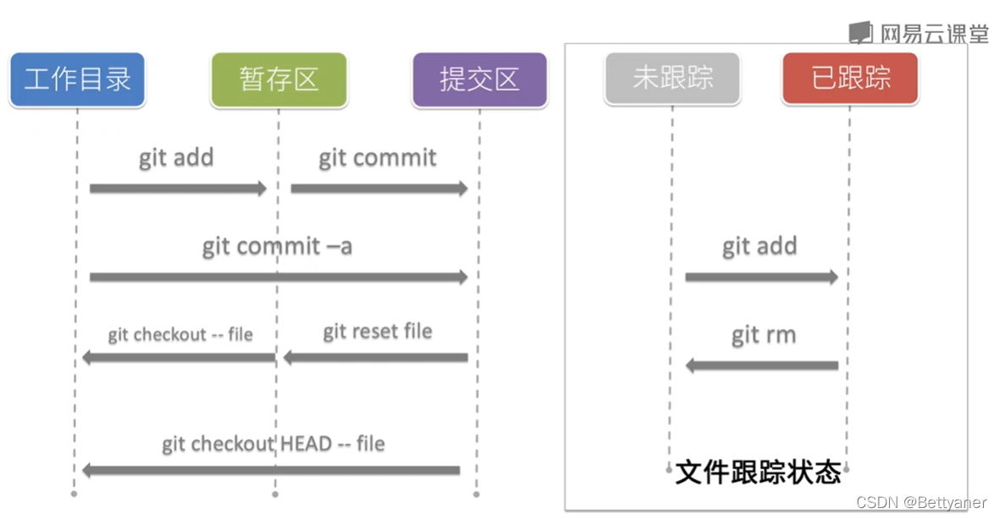

# CS:APP的学习笔记

### 为啥会做这样的一个笔记项目
+ 首先在学习的过程中无论是系统的学习还是零碎的了解相关知识，总是会出现很多遗忘的情况，用笔记记录可以更好地对学习的内容进行整理和复盘，也能方便日后的回顾。
+ 这也是我建立的第一个GitHub仓库，通过这样的一个笔记项目掌握一些基本的git和GitHub功能，更好地去管理自己的代码以及GitHub的使用。
+ 后续也会去做一些其他的笔记项目，对本科阶段以及研究生阶段的学习内容进行整理；同时也会将自己做的一些学习或者开发项目上传到GitHub上保管。

### 环境配置
这里选择的记笔记方式就是**VSCode+git+GitHub**来实现的。vscode中需要下好markdown的插件，注册好GitHub账号，下载好git，然后通过一些配置就可以开始愉快的记笔记并上传GitHub上保管了。

#### git的常用操作
>参考资料：[github的使用](https://zhuanlan.zhihu.com/p/369486197)   [git常用命令](https://blog.csdn.net/weixin_67585820/article/details/123554416)

1. `git config --global user.name "[name]"` 设置提交代码的用户名
2. `git config --global user.email "[email]"` 设置提交代码的电子邮箱
3. `git init` 初始化工作目录为一个仓库
4. `git clone [url]` 从GitHub上克隆一个仓库
5. `git add [file]` 指定工作目录下的文件添加到缓存区
6. `git add .` 全部文件添加到缓存区
7. `git commit -m "[message]"` 缓存区文件提交
8. `git commit -a` 所有文件添加并提交
9. `git remote add origin [remote server link]` 连接本地代码库和远程仓库
10. `git push` 提交远程仓库
11. `git pull` 从远程仓库拉取到本地
12. 克隆远程仓库创建的本地仓库本身就是一个git仓库了，并且自动关联远程仓库
13. 未完待续

#### VSCode的内置git使用
>参考资料：[vscode中git的使用](https://zhuanlan.zhihu.com/p/533002983)
1. "+"等于`git add .`
2. 对勾等于`git commit -m`
3. 直接点击上传云可以同步

### 注意事项
GitHub上对latex公式支持的依然不是很好，目前并不知道有什么特别好的解决办法。如果需要很好的查看笔记的话，还是选择拉取后在其他支持markdown的软件上查看。

//TODO
