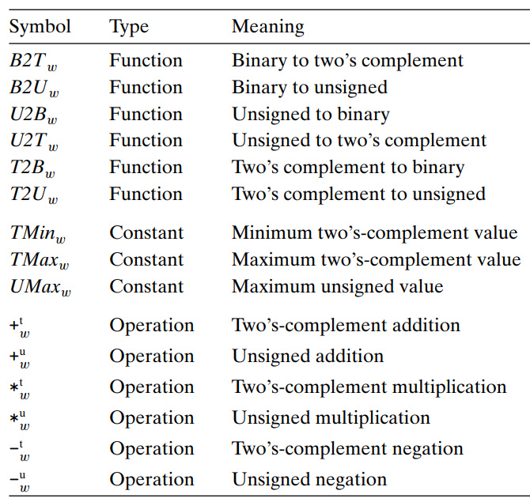
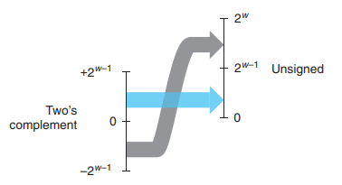

# 计算机中信息的表示和操作

计算机中的信息本质上就是一串比特，一串01序列，特定的编码规则组织的序列和上下文就可以准确而强大的表示信息。

## 信息的存储

### 几个基本的概念
1. 在**内存**(*memory*)中最小的存储单元是字节byte，这是最小的可寻址的内存单元。
2. **虚拟内存**(*virtual memory*)是对内存的一种抽象，将内存看作一个字节数组，每个字节会分配好一个地址。
3. **十六进制**(*hexadecimal notaionj*)表示方法中一个十六进制数可以表示半个字节（即四个bits）的信息，一个字节可以用两个十六进制数表示，使用十六进制可以更简明地表示计算机中的信息。
4. **字长**(*word size*)表示了指针数据所占的内存大小，因此，一个虚拟内存中的地址就被这样的一个字编码。如果一个计算机有$w$位的字长，则其**虚拟地址空间**(*virtual address space*)的范围就是从$0$到$2^w-1$；现在的计算机大多是64位字长的，并且向后兼容，64位的机器可以支持32位程序的运行，所以*32位程序*和*64位程序*的差别是指编译上处理的差别而不是运行机器的差别（32位的程序一样可以在64位的机器上运行）。
5. 字符串文本的二进制表示是将文本的每个字符用编码表示，常用的是ASCII字符编码和UTF-8编码。
6. 代码的二进制表示会随着机器的不同而有着不同的指令和编码方式，不同的操作系统上也会产生不同的编码方式。

### 多字节数据的存储

对于一个**程序对象**(*program object(include program data, instruction, and control information)*)，其可能需要多个字节来表示这样的一个对象的信息。这种情况是很常见的，而对于这种情况的存储需要考虑两个问题：这个对象的地址是什么？这些对象的字节数据应该以什么样的顺序存储在内存里？
- 对于第一个问题答案是很简单的，多字节的数据会存放在一个连续的虚拟地址空间中，其地址就是所用到这些内存的最小地址。
- 对于字节存放顺序的问题，这里有两种相反的顺序：**小端法**(*little endian*)规定多字节的数据会从低字节到高字节依次存放在内存中；**大端法**(*big endian*)则规定多字节的数据会从高字节到低字节依次存放在内存中。例如某个多字节数据0x12345678按照大端法和小端法的存储情况如下图所示。

- 对于大多数的Intel兼容的机器采用的都是小端法。

### 对0，1序列的一些操作和运算
1. **按位的布尔运算**：|：按位或；&：按位与；~：按位非；^：按位异或。这样的位级运算的一个应用是可以实现掩码的操作，具体的话有两个例子：x&0xFF可以将x的低字节数据保留，高字节数据置0； ~0可以产生全为1的掩码。
2. **C语言中的逻辑运算**：||：逻辑或；&&：逻辑与；！：逻辑非。这样的逻辑运算的结果只有两个值0（false），1（true）；对于非0的参数表示的都是1。
3. **C语言中的移位操作**：<<：向左移位，后面补0；>>：向右移位包括两种，**逻辑右移**(*logical right shift*)：前面补0；**算术右移**(*arithmetic right shift*)：前面补最高有效位的值。对于大多数的情况而言，对于有符号数进行算术右移，无符号数进行逻辑右移。

## 计算机中整型数据的表示

对整数进行编码表示，可以分为两种编码方式，一种是只能对非负整数编码(***unsigned encodings***)，而另一种可以对负数，0，正数都可以编码(***two's-complement encodings***)。下图是对这里会用到的数学符号的一个整理：

### C语言中整数的数据类型
|C data type |Minimum|Maximum|
|---|---|----|
|char|-128|127|
|unsigned char|0|255|
|short|-32768|32767|
|unsigned short|0|65535|
|int|$-2^{31}$|$2^{31}-1$|
|unsigned|0|$2^{32}-1$|
|long|long的数据大小和机器有关|在64位机为8个字节，32位机上是4个字节|
|unsigned long|0|-|
除了表中的这些整型数据，在C中还有固定大小的整型数据：int32_t,uint32_t,int64_t,uint64_t。

### 编码表示和一些转换操作
1. 无符号编码的定义：
对于一个bit vector $\vec x =[x_{w-1},x_{w-2},...,x_0]$有：
$$
B2U_w\left(\vec x\right)\dot=\sum_{i=0}^{w-1}x_i2^i
$$$B2U_w$可以看作一个从$w$位的01序列到非负整数集$\{0,...,UMax_w\}$的一个一一映射（其中$UMax_w\dot=2^w-1$），其逆映射记作$U2B_w$。
2. 补码编码的定义：
对于一个bit vector $\vec x =[x_{w-1},x_{w-2},...,x_0]$有：
$$B2T_w\left(\vec x\right)\dot=-x_{w-1}2^{w-1}+\sum_{i=0}^{w-2}x_i2^i$$$B2T_w$可以看作一个从$w$位的01序列到整数集$\{TMin_w,...,TMax_w\}$的一个一一映射（其中$TMin_w\dot=-2^{w-1},TMax_w\dot=2^{w-1}-1$），其逆映射记作$T2B_w$。
3. 在具有相同字长的整型数据之间进行**无符号数和有符号数的转换**，遵守的规则就是**不改变其01序列，改变的是解读这个01序列的方式**。更加数学的定义如下：
从有符号数$x$转到无符号数$u$：
$$u=T2U_w(x)\dot=B2U_w(T2B_w(x))=
\begin{cases}
x+2^w,&x\lt0\\
x,&x\ge0
\end{cases}
$$

从无符号数$u$转到有符号数$x$：
$$x=U2T_w(u)\dot=B2T_w(U2B_w(u))=
\begin{cases}
u,&u\le TMax_w\\
u-2^w,&u\gt TMax_w
\end{cases}
$$

在C语言中除了强制类型转换`(int) u`这种明显的情况会发生无符号数和有符号数之间的转换，还有一些不明显的情况：当**一种类型的表达式被赋值给另一种类型的变量**时，会发生隐式的类型转换；而**当进行运算时，运算数一个有符号而另一个无符号**，C语言中会将有符号数强制转换为无符号数，再进行运算。
4. 位拓展的操作经常发生在**从一个较小的数据类型转换为一个较大的数据类型**的情况中，对于无符号数而言，这种转换只需要将多出来的更高位置0即可，称为**零拓展**(*zero extension*)；对于有符号数来说。进行这种转换需要将多出来的更高位置成和符号位一样的值，称为**符号拓展**(*sign extension*)。经过这样的操作可以保证这转换前后的值不会发生变化。
5. 与4中相反的是，有时候会需要**从一个较大的数据类型转换为较小的数据类型**，此时会进行**截断**(*truncat*)的操作，即将多出来的高位直接去除即可。这样的转换会带来值的改变，具体的值变化可以通过如下公式计算得到：
对于无符号数，设被截断至$k$位，截断后的数值为$$x'=x \pmod {2^k}$$对于有符号数，截断后的数值为$$x'=U2T_k(x\pmod {2^k})$$

## 整型数据在计算机上的运算

## 浮点数的表示和运算
